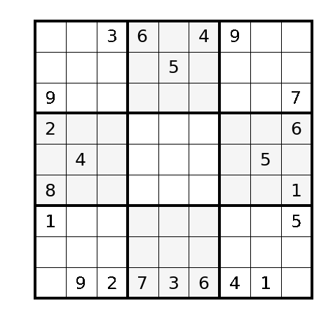
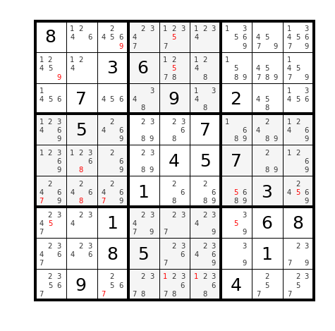
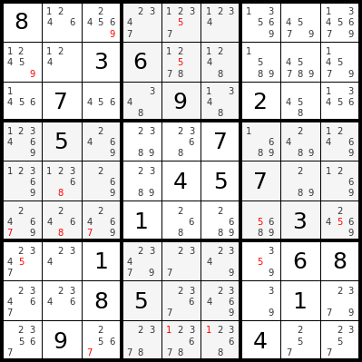

# A minimal Sudoku solver

What you will find here:

* a [self-contained, half-page implementation of a Sudoku solver][1] (try it out on [Repl][18]!)
* [Code][2] to print beautiful boards such as the one shown above ;)
* A rambling explanation of what I mean by "minimal".

## How many strategies are required to solve sudokus?

This all started, like many things, on a whim. On a plane. By the time the flight was over, I had a [basic solver][3]
that could complete all the "hard" boards from the plane's entertainment system. Back under the coverage of WiFi, I
found Sudokus that my code could not solve: [searching for "hardest sudoku" on Google][4], one typically lands on
[this Telegraph page][5] for the infamous "Everest" board, from Arto Inkala.

[The initial solver][3] implements three strategies:

* _basic elimination_ (remove the value of an assigned cell from its peers' candidates)
* _sole candidate_ (if all peers in a group cover all but 1 number, you're that number)
* _naked twins_ (if two cells in a group share the same two candidate values, remove those values from peers)

but there are dozens of them for solving sudokus. See for example:

1. [sudokuWiki][9] strategy families
2. [kristanix.com][8] solving techniques
3. sudokuDragon.com strategies: [basic][6] / [advanced][7]

## A single, generic elimination strategy (aka _the Rule_)

While adding the ["hidden twins"][10] strategy to the basic solver, I realized that the _naked_ and _hidden twins_
are instances of a more general rule (which we will call, for the rest of this piece, _the Rule_) that encompasses
altogether _hidden twins_, _naked twins_, hidden/naked triples, quadruples and so on. Moreover, that _basic
elimination_ and _sole candidate_ were also covered by that same rule when the subset of interest (a pair, a triple,
etc.) is of size 1. Here's [code][11] implementing that single general strategy:

    for subset_size, group in product(range(1, 9), groups):
        for subset in combinations(group, subset_size):
            candidates_in_subset = set(''.join(board[index] for index in subset))
            if len(candidates_in_subset) == len(subset):  # we found a constraint
                all_supersets = [g for g in groups if set(subset) <= set(g)]
                for cell in [cell for g in all_supersets for cell in g if cell not in subset]:
                    board[cell] -= candidates_in_subset

In words:

> for every subset of N cells in a row, column or square; if there are only N candidate values in the subset,
> you can remove those values from the cells' peers in any row, column or square that contains the subset.

The reasoning is similar to the ["naked twins"][10] rule: let's say we found two cells in a row that can only
contain a 2 or a 4: we do not know which value goes where, but know that these two values cannot appear in any
of the cells' peers in that row and for any other group both cells belong to.

_basic elimination_ corresponds to a subset size of 1: we have an assigned cell which contains 1 candidate value that
can be removed from all the other cells in the same row, column or square. _sole candidate_ corresponds to a subset
size of 8: there are 8 cells, covering up 8 values so the single cell left out must take the 9th one. _naked twins_
corresponds to a subset of size 2; its dual _hidden twins_ to a subset of size 7.

This strategy alone, in 7 lines of code, generalizes all the following:

* _basic elimination_ (subset size: 1)
* _sole candidate_ (subset size: 8)
* _unique candidate_ (subset size: 8)
* _only square_ (subset size: 8)
* _two out of three_ (subset size: 8)
* _sub-group exclusion_ (iterated elimination)
* _pointing pairs_ (common supersets)
* _pointing triples_ (common supersets)
* _naked twins_ (subset size: 2)
* _hidden twins_ (subset size: 7)
* _naked triplets_ (subset size: 3)
* _hidden triplets_ (subset size: 6)
* _naked quads_ (subset size: 4)
* _hidden quads_ (subset size: 5)
* _general permutation_
* _naked chains_
* _hidden chains_

So, **this is awesome**. This single rule suffices to solve most sudokus rated "very hard", "super fiendish", and
equivalent. But is it enough to solve any and every sudoku board?

## Can the _Rule_ solve every sudoku board?

Let's look again at the Everest board. If we keep applying the _Rule_ until no further candidate can be eliminated,
we are left with the following board state:

The small numbers in each unassigned cell are the remaining candidates (often called "pencil marks": the red ones are
those participating in a [_conjugated pair_][7], discussed later).

So, the answer is "_no_".

The _Rule_ is not enough by itself. Since it operates on a single group at a time, and propagates information within
groups only if they share cells, it fails to capture the group to group dependencies exploited by [more advanced
strategies][7]. Were we to implement those too, would we be capable then of solving every sudoku?

The answer is again, sadly, "_no_".

One easy way to convince oneself is to open the [board on SudokuWiki.com solver][12]. There, you can click
repeatedly on the "Take step" button: this applies a large collection of advanced strategies to the board, all of
which still ultimately fail to pinpoint the single correct solution.

## Is search/backtracking necessary?

[Advanced strategies][7] such as X-Wing, Swordfish, X-Y-Wing and extensions derive constraints from loops of conjugate
pairs (pairs of cells that, for a candidate number, mutually exclude each other). In a loop with an odd number of
cells, one of the two configurations leads to an inconsistent state and can be ruled out. For an even number of cells,
no inconsistency can be directly detected but one can remove candidates that are eliminated in either configuration.

All these strategies consider two or more alternate allocations of values in a collection of linked cells, and compare
the resulting state of the board in each one of the cases. They are, in essence, _search and backtracking_ strategies
in disguise, no more clever than brute forcing through all possible combinations. 

Since all the strategies based on conjugated tuples are equivalent to _search and backtracking_, the latter is the
second and final strategy required for solving any sudoku board. [sudoku.py][1] is a a self-contained solver based
on these two ideas.

[Peter Norvig's implementation][14] justifies the introduction of search to avoid the tedious exercise of implementing
dozens of rules, but it turns out adding search is a necessary evil if we are to solve any possible sudoku
instance. 

Ultimately the question "_can every sudoku instance be solved logically?_" is debatable. On one hand, there exist
sudoku boards that are impervious to all currently known human-applicable strategies. On the other, the _search and
backtracking_ strategy, oftentimes deemed inelegant by practitioners, is an instance of [proof by contradiction][17],
which is an integral part of the logic arsenal.

Refer to Wikipedia to read more about [the mathematics of sudoku][15] and the availble [solving algorithms][16].

[1]: https://github.com/r1cc4rdo/sudoku/blob/master/sudoku.py  "Self-contained solver"
[2]: https://github.com/r1cc4rdo/sudoku/blob/master/sudoku/board_plot.py "Graphical sudoku plot"
[3]: https://github.com/r1cc4rdo/sudoku/blob/master/sudoku/solver_wo_search.py "Basic solver w/o search"
[4]: http://lmgtfy.com/?q=hardest+sudoku "Search for \"hardest sudoku\" on Google"
[5]: https://www.telegraph.co.uk/news/science/science-news/9359579/Worlds-hardest-sudoku-can-you-crack-it.html "Everest board from Arto Inkala"
[6]: http://www.sudokudragon.com/sudokustrategy.htm "sudokuDragon.com basic strategies"
[7]: http://www.sudokudragon.com/advancedstrategy.htm "sudokuDragon.com advanced strategies"
[8]: https://www.kristanix.com/sudokuepic/sudoku-solving-techniques.php "kristanix.com solving techniques"
[9]: http://www.sudokuwiki.org/Strategy_Families "sudokuWiki strategy families"
[10]: http://www.sudokuwiki.org/Hidden_Candidates "Hidden candidates strategy"
[11]: https://github.com/r1cc4rdo/sudoku/blob/master/sudoku/solver_w_search.py "Solver with single rule and search"
[12]: http://www.sudokuwiki.org/sudoku.htm?bd=800000000003600000070090200050007000000045700000100030001000068008500010090000400 "Everest board in SudokuWiki's solver"
[13]: https://github.com/r1cc4rdo/sudoku/blob/master/sudoku.ipynb "Sudoku solver notebook"
[14]: http://norvig.com/sudoku.html "Peter Norvig's sudoku solver"
[15]: https://en.wikipedia.org/wiki/Mathematics_of_Sudoku "Wikipedia: Mathematics of Sudoku"
[16]: https://en.wikipedia.org/wiki/Sudoku_solving_algorithms "Wikipedia: Sudoku solving algorithms"
[17]: https://en.wikipedia.org/wiki/Proof_by_contradiction "Wikipedia: proof by contradiction"
[18]: https://repl.it/@riccardog/sudoku "Repl.it: r1cc4rdo's Sudoku solver"
